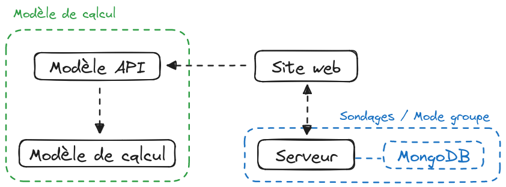

# Architecture du projet

## Structure du projet

Le projet est divisé en deux grandes parties : le **site web** et le **modèle
de calcul**.

Le site web est lui-même divisé en deux parties : la partie **front** et la
partie **back**.

## Récapitulatif des dépôt GitHub

| Nom du dépôt                                                                                     | Description                                                                                        | Scope             | Liens                                                                                                                                                                                                                                                                                                                                                                   |
| ---                                                                                              | ---                                                                                                | ---               | -----                                                                                                                                                                                                                                                                                                                                                                   |
| [`nosgestesclimat`](https://github.com/incubateur-ademe/nosgestesclimat)                         | Code source du modèle de calcul                                                                    | `Modèle`          | [NPM](https://www.npmjs.com/package/@incubateur-ademe/nosgestesclimat)                                                                                                                                                                                                                                                                                                  |
| [`nosgestesclimat-api`](https://github.com/incubateur-ademe/nosgestesclimat-api)                 | Code source de l'API exposant les règles compilées                                                 | `Modèle`          | [Prod](https://nosgestesclimat-api.osc-fr1.scalingo.io/) / [Scalingo](https://dashboard.scalingo.com/apps/osc-fr1/nosgestesclimat-api) / [Cypress](https://cloud.cypress.io/projects/7wuiy2/runs?branches=%5B%5D&committers=%5B%5D&flaky=%5B%5D&page=1&status=%5B%5D&tags=%5B%5D&timeRange=%7B%22startDate%22%3A%221970-01-01%22%2C%22endDate%22%3A%222038-01-19%22%7D) |
| [`nosgestesclimat-doc`](https://github.com/incubateur-ademe/nosgestesclimat-doc)                 | Code source de ce site                                                                             | `Modèle` `Site`   | [Prod](https://incubateur-ademe.github.io/nosgestesclimat-doc)                                                                                                                                                                                                                                                                                                          |
| [`nosgestesclimat-scripts`](https://github.com/incubateur-ademe/nosgestesclimat-scripts)         | Code source du code commun utilisés par les différents scripts                                     | `Modèle` `Site`   | [NPM](https://www.npmjs.com/package/@incubateur-ademe/nosgestesclimat-scripts)                                                                                                                                                                                                                                                                                          |
| [`nosgestesclimat-server`](https://github.com/incubateur-ademe/nosgestesclimat-server)           | Code source du serveur utilisé pour les sondages                                                   | `Site`            | [Prod](https://nosgestesclimat.osc-fr1.scalingo.io/) / [Scalingo](https://dashboard.scalingo.com/apps/osc-fr1/nosgestesclimat)                                                                                                                                                                                                                                          |
| [`nosgestesclimat-site-nextjs`](https://github.com/incubateur-ademe/nosgestesclimat-site-nextjs) | Code source du site web                                                                            | `Site`            | [Prod](https://nosgestesclimat.fr) / [Vercel](https://vercel.com/nos-gestes-climat/nosgestesclimat)  / [Cypress](https://cloud.cypress.io/projects/bkkrae/runs?branches=%5B%5D&committers=%5B%5D&flaky=%5B%5D&page=1&status=%5B%5D&tags=%5B%5D&timeRange=%7B%22startDate%22%3A%221970-01-01%22%2C%22endDate%22%3A%222038-01-19%22%7D)                                   |
| [`publicodes-commun`](https://github.com/incubateur-ademe/publicodes-commun)                     | Ensemble de règles communes utilisées pour l'implémentation des modèles Publicodes de l'incubateur | `Modèle`          | [Doc](https://incubateur-ademe.github.io/publicodes-commun/) / [NPM](https://www.npmjs.com/package/@incubateur-ademe/publicodes-commun)                                                                                                                                                                                                                                 |
| [`@publicodes/tools`](https://github.com/publicodes/tools)                                       | Ensemble de fonctions utilisées pour la compilation du modèle                                      | `Modèle`          | [Doc](https://publicodes.github.io/tools/) / [NPM](https://www.npmjs.com/package/@publicodes/tools)                                                                                                                                                                                                                                                                     |
