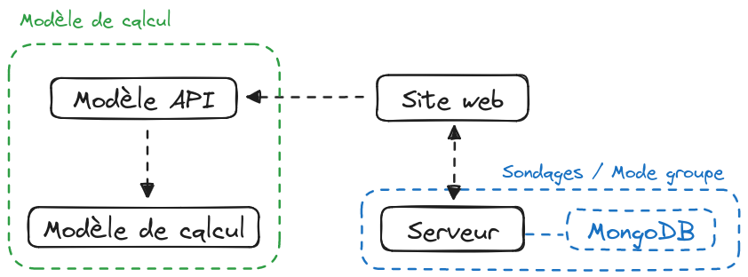

# Architecture du projet

## Structure du projet

Le projet est divisé en deux grandes parties : le **site web** et le **modèle
de calcul**.

Le site web est lui-même divisé en deux parties : la partie **front** et la
partie **back**.

