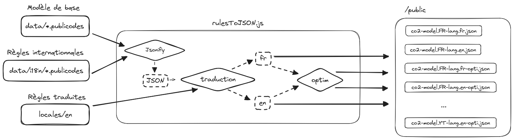

# Compilation

Afin de pouvoir être utilisé par le [site](../../website), le modèle de calcul
doit être _compilé_ en un seul fichier JSON. Ce fichier est ensuite chargé par
le site et utilisé pour calculer les résultats avec le [moteur de
calcul](https://publi.codes/docs/api/core).

## Les étapes de la compilation

L'ensemble des fichiers `./data/*.publicodes` représentent la version du **modèle
de base** (`FR-fr`).

**Workflow de compilation**

